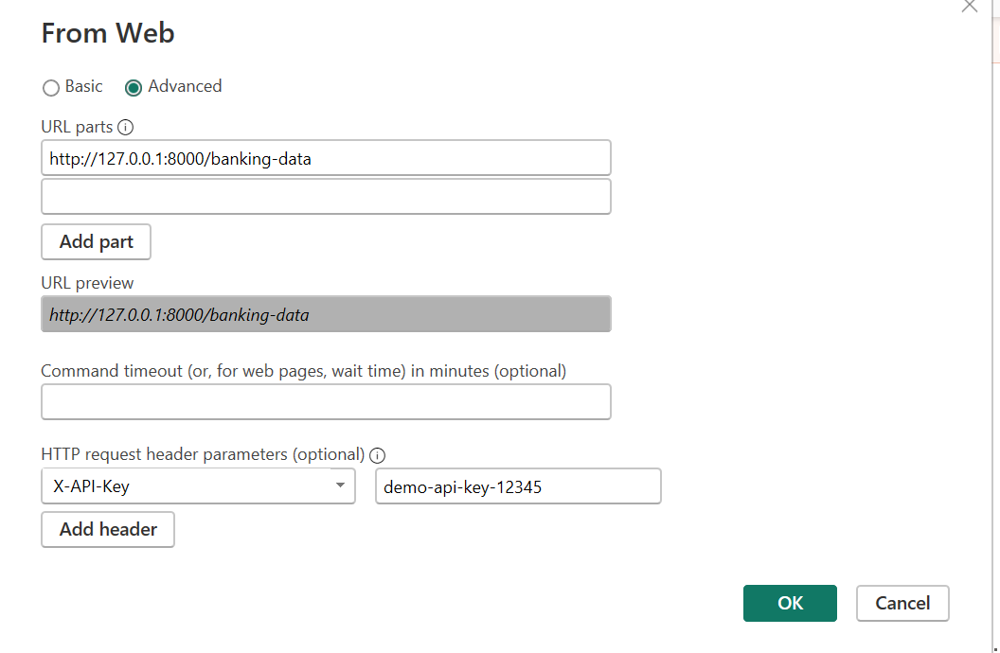

# Disclaimer
This guide does not represent any real data but for self explanatory purpose only

## requirements.txt 
- make sure to install all dependency in this project. use:
    ```
    pip install -r requirements.txt
    ```

## working-api.txt
- working-api.txt contain workable api without credentials
- ensure to run below to enable fastapi server run up:

    ```
    uvicorn app:app --reload --host 0.0.0.0 --port 8000
    ```

## app.py (fastapi)
- code contain script build up for rest api
- contain credential key to query duck db
- has authentication in url header ! **Not in Params!**

- To use this in PowerBI:
    - Get Data -> Web
    - Enter URL: http://localhost:8000/banking-data
    - Click "Advanced"
    - Add header:

    ```
    X-API-Key : demo-api-key-12345
    ```

    As in image below for setup reference:

    

    - Click OK

- If you try to access the API without the correct API key, you'll get a 403 Forbidden error. You can test this in your browser by:

- Going to http://localhost:8000/banking-data (should see 403 error)

- Using a tool like Postman or curl with the correct header:

    ```
    curl -H "X-API-Key: demo-api-key-12345" http://localhost:8000/banking-data
    ```

- Feel free to change the API_KEY value in the code to any string you prefer!